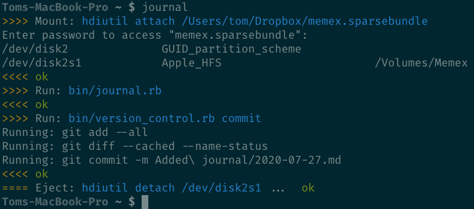

Memex
=====

This is a work-in-progress personal project. I might write about it if it
actually works for me. Time will tell.

Zettel
------

From Vim:

 - [X] ZettelNew: Create new zettel
 - [X] ZettelOpen: Fuzzy find zettel based on title
 - [X] ZettelGrep: Full text search for zettels
 - [X] Tab-based zettel link autocompletion
 - [X] Ctrl-] jumps to linked files
 - [X] Syntax highlighting for hashtags
 - [ ] Vim config tailored for text editing (wrapping, etc.)
 - [ ] Store ZettelGrep results in the quickfix list
 - [ ] Handle zero ZettelGrep results case (it's doing some weird error)
 - [ ] Search by hashtag
 - [ ] Search by absence of hashtag
 - [ ] ZettelOpenRecent (like FZFMru)

From command line:

 - [X] bin/zettel.rb new: Create and edit new zettel
 - [X] Auto-delete new zettels that haven't been edited
 - [X] bin/zettel.rb open: Open vim ready to fuzzy find zettel
 - [ ] Find and replace for hashtags

Journal
-------

 - [X] CLI for opening today's journal, creating the file if needed
 - [X] CLI for opening yesterday's journal, creating the file if needed
 - [X] Auto-delete new files if they haven't been edited
 - [X] Jump to previous or next entry using `[f` and `]f` (`tpope/vim-unimpared`)
 - [ ] Vim config tailored for text editing (wrapping, etc.)

Wiki
----

 - It's a folder of linked markdown, yo.

References
----------

 - TODO: links to, or copies of, external materials in an easy-to-reference
   format

Memex
-----

 - [X] CLI for mounting volume
 - [X] CLI for ejecting volume
 - [X] CLI as shortcut for mounting, running script, then ejecting
 - [ ] Auto commit changes to separate git repo that only holds the data dir

